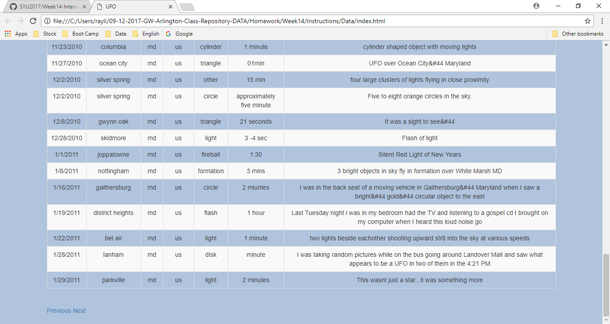
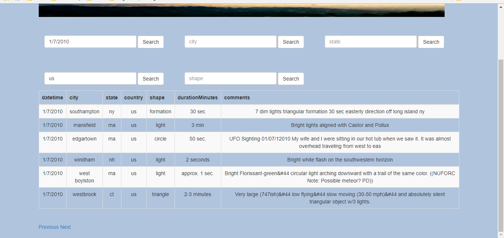

# Week14-Interactive-Web-JavaScript-and-DOM-Manipulation

### Level 1: Automatic Table and Date Search--"index.html" and "index.js"

* Create a basic HTML web page--"index.html".

* Using the ufo dataset provided in the form of a JavaScript object---"index.js", write code that appends a table to your web page and then adds new rows of data for each UFO sighting.

  * Make sure you have a column for `date/time`, `city`, `state`, `country`, `shape`, and `comment` at the very least.

* Add an `input` tag to your HTML document and write JavaScript code that will search through the `date/time` column to find rows that match user input.

### Level 2: Multiple Search Categories

* Complete all of Level 1 criteria.

* Using multiple `input` tags and/or select dropdowns, write JavaScript code in "index.js" so the user can to set multiple filters and search for UFO sightings using the following criteria based on the table columns: 

  1. `date/time`
  2. `city`
  3. `state`
  4. `country`
  5. `shape`

### Level 3: Paginated Table

* Complete all of Level 2 criteria.

* Write code that will paginate the table (client-side pagination) and only display a maximum set number of results at a time (e.g. 50 results per page). Use [Bootstrap's Pagination Components](http://getbootstrap.com/components/#pagination) and write code to handle page changes and calculate the number of results which should appear on each page. 
* These changes should happen in the DOM using JavaScript, therefore the user should never be directed to another web page as they paginate through the results.
* I put the pagination code in script in "index.html" and click search button in "index.js". 

- - -

### Dataset

* [UFO Sightings Data](data.js)

### DataTables resolution: " index-dataTables.html" and " index-dataTables.js"  
DataTables is a plug-in for the jQuery Javascript library.
It is a highly flexible tool, based upon the foundations of progressive enhancement, and will add advanced interaction controls to any HTML table.

Pagination, instant search and multi-column ordering
Supports almost any data source:
DOM, Javascript, Ajax and server-side processing
Easily theme-able: DataTables, jQuery UI, Bootstrap, Foundation

I also created " index-dataTables.html" and " index-dataTables.js" to search the UFO sighting data. 

